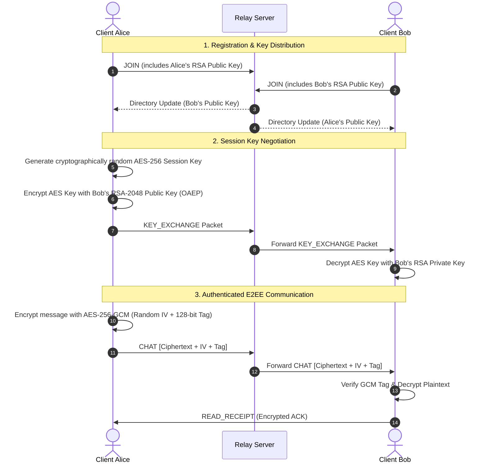
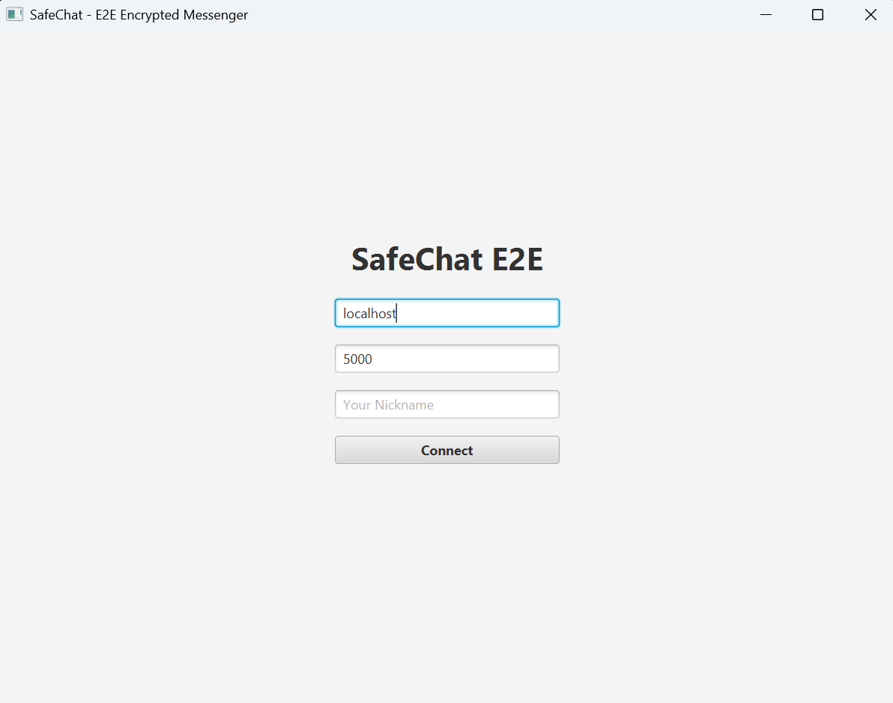
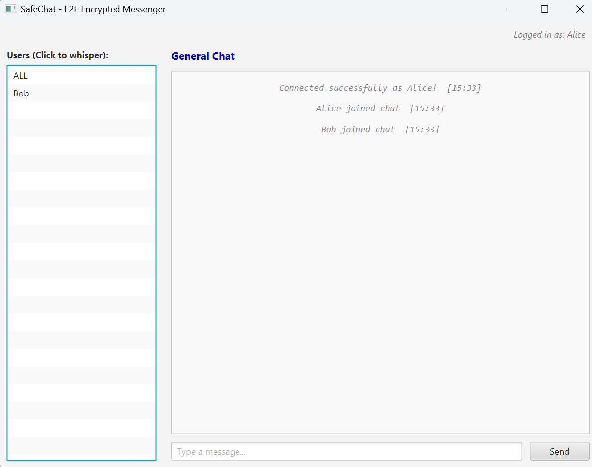
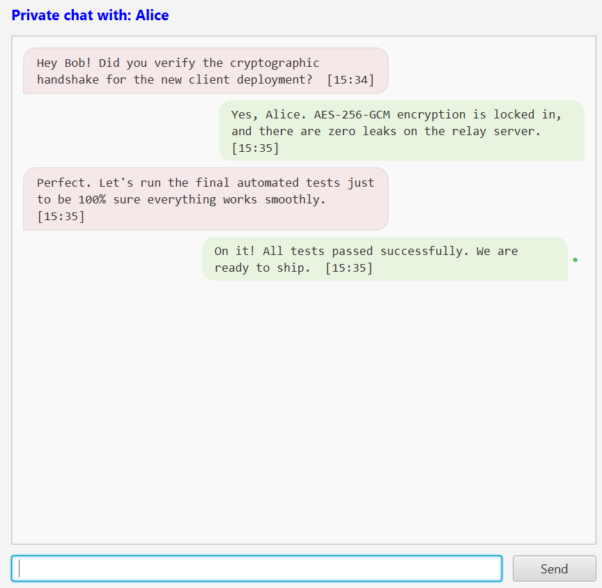
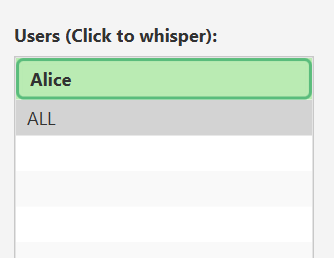

<div align="center">

# 🔒 SafeChat Communicator
**Enterprise-Grade, Zero-Knowledge Real-Time Messaging System with Hybrid E2EE**

[](https://openjdk.org/)
[](https://openjfx.io/)
[](https://maven.apache.org/)
[](https://en.wikipedia.org/wiki/End-to-end_encryption)
[](https://junit.org/junit5/)
[](LICENSE)

<p align="center">
  A multi-threaded client-server chat application engineered with <b>Hybrid End-to-End Encryption (E2EE)</b>, a <b>Zero-Knowledge Relay Server</b>, resilient <b>packet fragmentation</b>, and a responsive <b>JavaFX desktop interface</b>.
</p>

</div>

---

## 📑 Table of Contents
- [Key Highlights](#-key-highlights)
- [System Architecture](#-system-architecture)
  - [Zero-Knowledge Relay Concept](#zero-knowledge-relay-concept)
  - [Cryptographic Workflow](#cryptographic-workflow)
- [Security & Engineering Highlights](#-security--engineering-highlights)
- [Application Features](#-application-features)
- [Project Structure](#-project-structure)
- [Getting Started](#-getting-started)
  - [Prerequisites](#prerequisites)
  - [Starting the Server](#1-starting-the-server)
  - [Launching the Client GUI](#2-launching-the-client-gui)
  - [Building Standalone Fat-JAR](#3-building-standalone-fat-jar)
- [Automated Testing](#-automated-testing)
- [Technology Stack](#-technology-stack)
- [License](#-license)

---

## 🌟 Key Highlights

* **Zero-Knowledge Relay Architecture**: The central server acts exclusively as an untrusted message broker. It routes encrypted packets and public keys but possesses zero visibility into message contents or session keys.
* **Hybrid Cryptographic Suite**:
  * **Asymmetric (RSA-2048 OAEP)** with SHA-256 and MGF1 padding for tamper-resistant peer key exchange.
  * **Symmetric (AES-256 GCM)** with a unique 12-byte IV per message and 128-bit authentication tag for authenticated data encryption.
* **Secure Deserialization**: Java Serialization stream defended by strict `ObjectInputFilter` policies rejecting unauthorized classes to mitigate remote code execution.
* **Smart Message Chunking**: Automatic fragmentation and reassembly engine for payloads exceeding transport limits (up to 10 chunks &times; 10,000 characters) with automated timeout eviction.
* **Modern JavaFX UI**: Polished chat bubble aesthetics, presence tracking, dynamic user list sorting by last interaction, and real-time read receipt indicators.
* **High Concurrency & Thread-Safety**: Decoupled network worker daemons, non-blocking UI mutations via `Platform.runLater()`, and synchronized socket stream flushing.

---

## 🏛 System Architecture

### Zero-Knowledge Relay Concept
SafeChat operates on a blind-relay topology where end clients negotiate their own cryptography peer-to-peer over standard TCP sockets.

```
       ┌───────────────────────────────┐
       │   SafeChat Relay Server       │
       │   (Untrusted Router Broker)   │
       └───────▲───────────────┬───────┘
               │               │
  [Encrypted Ciphertext]  [Encrypted Ciphertext]
  [No Decryption Key]     [No Decryption Key]
               │               │
       ┌───────┴───────┐       ┌───────▼───────┐
       │  Client Alice │◄═════►│   Client Bob  │
       │  (RSA + AES)  │  E2EE │  (RSA + AES)  │
       └───────────────┘       └───────────────┘
```

### Cryptographic Workflow



---

## 🛡 Security & Engineering Highlights

| Component | Implementation | Specification |
| :--- | :--- | :--- |
| **Asymmetric Cipher** | RSA / ECB / OAEPWithSHA-256AndMGF1Padding | 2048-bit Key Size, X.509 DER Encoding |
| **Symmetric Cipher** | AES / GCM / NoPadding | 256-bit Key Size, 12-byte random IV, 128-bit Auth Tag |
| **Integrity Assurance** | Galois/Counter Mode (GCM) Authentication Tag | Prevents replay, bit-flipping, and tampering |
| **Serialization Guard** | Java `ObjectInputFilter` pattern matching | Strict whitelist (`com.safechat.shared.*`, primitives) |
| **Transport Layer** | Raw TCP Sockets (`ServerSocket` / `Socket`) | High-throughput, zero external web dependencies |
| **Memory Isolation** | `ConcurrentHashMap` & Ephemeral Keys | Session keys held solely in memory, never persisted |

---

## 💬 Application Features

- **Public & Whispered Channels**: Broadcast openly to `#ALL` or initiate confidential 1-on-1 private rooms.
- **Dynamic Presence & User Discovery**: Live `JOIN` and `LEAVE` notifications seamlessly update the roster.
- **Read Receipts & Delivery Indicators**:
  - `○` Empty bullet: Sent, delivered to relay.
  - `●` Filled green bullet: Read by the recipient.
- **Conversation Sorting**: Users in the contact list dynamically sort with active conversations pinned to the top.
- **Unread Notification Highlights**: Visual badges and borders highlight contacts with unread messages.
- **Defensive Error Handling**: Automatic reconnection warnings, port bounds verification (1–65535), and nickname sanitization against server collision.

---

## 📸 User Interface (UI)

Here is what the SafeChat JavaFX graphical user interface looks like, featuring the connection screen, general chat view, and encrypted private conversations:

<p align="center">
  
  <br>
  <em>Connection and login screen allowing users to specify the host, port, and nickname before entering the secure network.</em>
</p>

<br>

<p align="center">
  
  <br>
  <em>Main application screen showing the active user list, All-chat and logged-in state as Alice.</em>
</p>

<br>

<p align="center">
  
  <br>
  <em>Encrypted 1-on-1 private chat view utilizing the custom test dialog.</em>
</p>

<br>

<p align="center">
  
  <br>
  <em>Dynamic highlighting and unread message notifications displayed directly on the contact list.</em>
</p>

---

## 📂 Project Structure

```text
SafeChat-Communicator/
├── src/
│   ├── main/
│   │   ├── java/com/safechat/
│   │   │   ├── client/
│   │   │   │   ├── ChatController.java    # JavaFX UI controller & presentation logic
│   │   │   │   ├── ClientGUI.java         # Application lifecycle bootstrap & stage setup
│   │   │   │   ├── CryptoService.java     # RSA-2048 / AES-256 cryptographic engine
│   │   │   │   ├── Launcher.java          # JavaFX runtime module entry point (Fat-JAR)
│   │   │   │   └── NetworkService.java    # Socket listener, chunking & packet dispatch
│   │   │   ├── server/
│   │   │   │   ├── ClientHandler.java     # Per-client connection thread & filter guard
│   │   │   │   ├── ConnectionManager.java # Thread-safe directory & message routing
│   │   │   │   └── ServerMain.java        # TCP Server bootstrap & port listener
│   │   │   └── shared/
│   │   │       └── MessageDTO.java        # Immutable network packet DTO & Builder
│   │   └── resources/
│   │       └── chat-view.fxml             # Declarative JavaFX UI layout definition
│   └── test/java/com/safechat/
│       ├── client/                        # Unit tests for crypto and network services
│       ├── integration/                   # Full-cycle client-server & crypto roundtrip tests
│       ├── server/                        # Concurrency and registry unit tests
│       └── shared/                        # DTO serialization and chunking tests
├── pom.xml                                # Maven build descriptor, plugins & deps
└── README.md                              # Project documentation
```

---

## 🚀 Getting Started

### Prerequisites
* **Java Development Kit (JDK)**: Version 26 (or JDK 21+ with modern language support)
* **Apache Maven**: Version 3.9 or higher

> [!NOTE]
> All JavaFX runtime dependencies (version 22) are pulled automatically by Maven. No local JavaFX SDK installation or path configuration is required.

---

### 1. Starting the Server

The server boots on port `5000` by default (or prompts for a custom port):

**Via Terminal (Maven):**
```bash
mvn exec:java
```

**Via IDE:**
Execute the `main` method in [`com.safechat.server.ServerMain`](src/main/java/com/safechat/server/ServerMain.java).

---

### 2. Launching the Client GUI

Open multiple terminal windows or IDE instances to test communication between multiple users:

**Via Terminal (Maven):**
```bash
mvn javafx:run
```

**Via IDE:**
Execute the `main` method in [`com.safechat.client.Launcher`](src/main/java/com/safechat/client/Launcher.java).

---

### 3. Building Standalone Fat-JAR

SafeChat is pre-configured with `maven-shade-plugin` to package a single executable binary embedding all dependencies, JavaFX native runtimes, and resources:

```bash
# Clean, compile and package
mvn clean package

# Run the packaged executable
java -jar target/SafeChat-1.0-SNAPSHOT.jar
```

---

## 🧪 Automated Testing

SafeChat features a comprehensive test suite of **74 automated tests** covering cryptography verification, network failure conditions, concurrent message routing, and serialization security:

```bash
mvn test
```

### Test Coverage Highlights
* **Crypto Roundtrip Tests**: End-to-end validation of RSA key encapsulation and AES-GCM encryption/decryption cycles.
* **Fragmentation & Reassembly**: Verification of large message chunking, out-of-order frame prevention, and eviction buffers.
* **Concurrency & Load**: Multi-threaded socket simulations testing simultaneous broadcasts and whisper routing.
* **Security Constraints**: Serialization injection defenses and invalid packet rejection.

---

## 🛠 Technology Stack

* **Language**: Java 26
* **UI Framework**: JavaFX 22 (`javafx-controls`, `javafx-fxml`)
* **Cryptography**: Java Cryptography Architecture (JCA / JCE) – RSA-OAEP, AES-GCM
* **Build System**: Apache Maven
* **Testing**: JUnit Jupiter 5.11.4, Mockito 5.18.0, ByteBuddy
* **Packaging**: Apache Maven Shade Plugin (Fat-JAR)

---

## 📄 License

This project is licensed under the [MIT License](LICENSE) — feel free to use and adapt it for educational and portfolio purposes.
